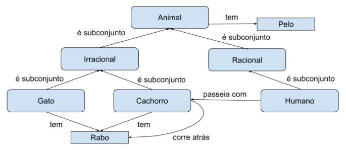
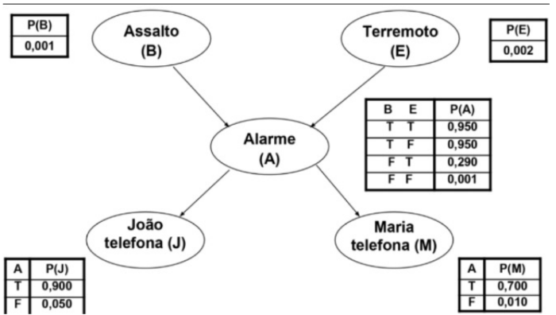

# Quiz 10

### Questão 1: Acerca das redes semânticas estudadas em aula, marque a alternativa INCORRETA:

Escolha uma opção:

- [ ] Redes de definição, como é possível no paradigma orientado a objetos, focam em modelar as relações de pertencimento a uma certa categoria. Esse tipo de rede é reconhecida por conseguir definir relações de heranças, como também permitir cópia de propriedade definidas nos supertipos para os subtipos.
- [ ] Redes executáveis contém mecanismos dinâmicos em sua construção, como procedimentos que as permitem executar inferências, passagem de mensagens, busca por padrões, entre outros. Um exemplo são as redes de Petri.
- [x] Redes de Aprendizado armazenam seus conhecimentos de forma procedural, através da especificação de regras de negócio codificadas pelo seu criador na forma de neurônios. E, normalmente, não necessitam de qualquer treinamento, já que seu conhecimento é estático. ✓
- [ ] Redes de implicação são geralmente utilizadas para representar causalidade e padrões de crenças, justamente por permitirem o estabelecimento de implicações entre seus nós, como também a associação de probabilidades a tais relacionamentos.

### Questão 2: Com base na seguinte árvore semântica, marque as alternativas que derivam proposições verdadeiras baseadas inteiramente nessa representação do conhecimento.

Escolha uma opção:

- [x] Cachorros correm atrás do próprio rabo ✓
- [x] Humanos tem pelos ✓
- [ ] Gatos são animais irracionais e tem pelo preto
- [ ] Humanos passeiam com gatos

### Questão 3: Considerando a Rede Bayesiana abaixo, calcule a probabilidade de ocorrência de uma situação em que o alarme tocou, houve um assalto, não houve terremoto e tanto João quanto Maria telefonaram.

Escolha uma opção:

- [x] 0,000597 ✓
- [ ] 0,596706
- [ ] 0,000182
- [ ] 0,000628
- [ ] 0,001196

### Questão 4: Considere uma representação do conhecimento (usando lógica) para o mundo do Wumpus, onde os poços causam brisas em cavernas adjacentes e o Wumpus causa mau cheiro em cavernas adjacentes. Além disso, considere que o mundo de Wumpus é representado por uma matriz 4 x 4. Por último, considere que Pi,j é verdadeiro se há um poço em [i, j]; Bi,j é verdadeiro se há uma brisa em [i, j]; Wi,j é verdadeiro se há um Wumpus em [i, j] e Mi,j é verdadeiro se há um mau cheiro em [i, j]. Dessa forma, assinale a sentença lógica INCORRETA.

Escolha uma opção:

- [ ] M2,2 ⇔ (W2,1 ∨ W1,2, ∨ W3,2 ∨ W2,3)
- [ ] M1,1 ⇔ (W1,2 ∨ W2,1)
- [ ] W1,1 ⇔ (M1,2 ∧ M2,1)
- [x] B2,1 ⇔ (P1,1 ∨ P3,1) ✓
- [ ] B1,1 ⇔ (P1,2 ∨ P2,1)

### Questão 5: Assinale a afirmação INCORRETA.

Escolha uma opção:

- [ ] Princípio de Resolução é um mecanismo de inferência por redução ao absurdo que requer a conversão da base de conhecimento para uma Forma Normal Conjuntiva.
- [ ] Encadeamento para frente e para trás permitem realizar inferências lógicas sobre bases de conhecimento, sendo o primeiro tipo orientado a dados e o segundo, orientado a objetivos.
- [x] Checagem de modelos permite demonstrar se uma sentença lógica (alfa) é ou não consequência lógica de uma base de conhecimento (BC) sempre que o conjunto dos modelos de alfa é igual ou está contido no conjunto dos modelos da BC. ✓
