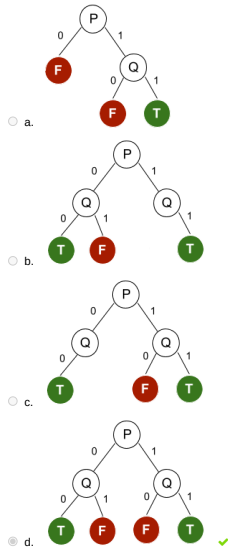

# Quiz 13

### Questão 1: (Baseado no Poscomp) Árvores de decisão são algoritmos que utilizam:

Escolha uma opção:

- [ ] Exclusivamente funções matemáticas como estruturas de dados elementares para realizar aprendizado.
- [ ] Estruturas de repetição alinhadas para realizar aprendizado.
- [ ] Estruturas de IF-ELSE para realizar aprendizado.
- [x] Aprendizado estatístico com base na distribuição das decisões para construção de regras no aprendizado. ✓
- [ ] Paradigma de programação em lógica para realizar aprendizado.

### Questão 2: Relacione os conceitos:

Entropia → Medida de aleatoriedade de uma variável.
Ganho → Medida da redução de entropia.
ID3 → Algoritmo para usado para induzir uma árvore de decisão a partir de um conjunto de dados de treinamento.
Exemplo → Valores dos atributos acompanhado do valor do predicado meta.
Conjunto de Treinamento → Conjunto completo de exemplos.
Árvore de Decisão → Conjunto de nós de decisão e nós folhas que implementam um modelo de classificação.

### Questão 3: Funções booleanas podem ser representadas a partir de árvores de decisão. Com isso em mente, indique qual a árvore de decisão melhor representa a expressão **(p ∨ q) → (p∧ q)**.

Escolha uma opção:

### Questão 4: Considere o conjunto de dados abaixo referente ao histórico de clientes que solicitaram empréstimos. Risco é o predicado meta.

Utilize a fórmula da entropia vista na última aula.

A) Qual é a entropia do conjunto de exemplos acima? Lembrar que "Risco" é o predicado meta. Resposta esperada com 2 casas decimais, exemplo : 1.44

- Resposta: 1,53 ✓

### Questão 5: Considere o conjunto de dados abaixo referente ao histórico de clientes que solicitaram empréstimos. Risco é o predicado meta.

Utilize a fórmula da entropia vista na última aula.

B) Qual é o ganho de informação quando usamos o atributo Histórico de Crédito com atributo para prever o risco? Resposta esperada com 2 casas decimais, exemplo : 1.44

- Resposta: 0,26 ✓

### Questão 6: Considere o conjunto de dados abaixo referente ao histórico de clientes que solicitaram empréstimos. Risco é o predicado meta.

Utilize a fórmula da entropia vista na última aula.

C) Qual atributo será selecionado como primeiro atributo a dividir o conjunto? Responda 1 para histórico de crédito, 2 para débito, 3 para renda ou 4 para risco.

- Resposta: 3 ✓

### Questão 7: Considere o conjunto de dados abaixo referente ao histórico de clientes que solicitaram empréstimos. Risco é o predicado meta.

Utilize a fórmula da entropia vista na última aula.

D) Indicar qual das 3 opções é a árvore de decisão induzida para este conjunto de dados utilizando-se o algoritmo ID3 (responda 1 para a primeira, 2 para a segunda e 3 para a terceira).

- Resposta: 3 ✓
