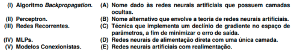

# Quiz 14

### Questão 1: Sobre as redes neurais artificiais, marque a(s) alternativa(s) correta(s):

Escolha uma ou mais:

- [ ] Um tipo de aprendizado supervisionado de redes neurais artificiais é o baseado em correção de erros. Nele, as redes aprendem através do processo de alteração dos pesos em suas conexões, com vista a maximizar o erro entre a saída real e a esperada.
- [x] Redes neurais artificiais conseguem aprender por meio de um conjunto de exemplos e apresentar respostas coerentes para entradas nunca vistas, como também são capazes de se adaptar a novos ambientes através da alteração de seus pesos. ✓
- [x] As camadas intermediárias/escondidas de uma rede neural artificial concentram a maior parte do processamento por meio de suas conexões ponderadas. Elas podem ser tanto usadas para extrair características da entrada como também classificá-la. ✓
- [x] Enquanto redes neurais acíclicas representam uma função de suas entradas e não têm um estado interno, a parte dos seus pesos, as cíclicas ou recorrentes podem ser realimentadas pelas suas saídas, fazendo com que uma determinada resposta possa depender de entradas anteriores. ✓

### Questão 2: (POSCOMP) Considerando as Redes Neurais Artificiais, relacione a coluna da esquerda com a da direita.

Escolha uma opção:

- [ ] I-A, II-B, III-C, IV-D, V-E.
- [ ] I-A, II-C, III-E, IV-D, V-B
- [ ] I-C, II-D, III-E, IV-B, V-A
- [x] I-C, II-D, III-E, IV-A, V-B. ✓
- [ ] I-C, II-B, III-A, IV-D, V-E

### Questão 3: Acerca das vantagens e desvantagens ao se utilizar redes neurais artificiais, marque a INCORRETA:

Escolha uma opção:

- [x] A estabilidade de seus algoritmos de otimização faz com que as redes neurais artificiais sejam bastante rápidas ao convergir para uma acurácia (porcentagem de acerto da rede neural) alta. ✓
- [ ] Pode ser difícil expressar os conhecimentos adquiridos por uma rede neural artificial, depois de seu treinamento, de forma que seja compreensível por seres humanos.
- [ ] O custo computacional requerido no processo de aprendizagem pode ser bastante elevado
- [ ] As redes neurais artificiais podem ser utilizadas na aquisição automática de conhecimentos, dada uma base de treinamento referente ao problema que se quer resolver.

### Questão 4: O princípio geral de funcionamento de um algoritmo para treinamento supervisionado de redes neurais artificiais é a minimização de uma função de erro ou perda.

Escolha uma opção:

- [x] Verdadeiro ✓
- [ ] Falso

### Questão 5: Uma rede neural artificial não é uma implementação fiel de um sistema neural biológico, dado que vários detalhes do funcionamento biológico precisam ser abstraídos devido à sua alta complexidade. Por exemplo, a função dos diferentes neurotransmissores é completamente ignorada.

Escolha uma opção:

- [x] Verdadeiro ✓
- [ ] Falso

### Questão 6: Um autocodificador é uma rede neural multicamada (entrada, camada escondida e camada saída) que aprende uma codificação compacta das entradas ao possuir uma camada escondida de menor dimensão e utilizar as próprias entradas como saídas desejadas no processo de treinamento.

Escolha uma opção:

- [x] Verdadeiro ✓
- [ ] Falso

### Questão 7: Uma rede neural Perceptron Multicamadas é bastante útil na aprendizagem de problemas que envolvam a classificação/reconhecimento de sinais em uma ou mais dimensões. O treinamento se dá de forma não supervisionada.

Escolha uma opção:

- [ ] Verdadeiro
- [x] Falso ✓

### Questão 8: O problema da superespecialização (overfitting) está associado a erros de generalização altos em conjuntos de validação/teste, sendo uma preocupação presente no projeto e uso de redes neurais com muitas camadas, que são mais vulneráveis ao problema devido ao excessivo número de parâmetros de treinamento.

Escolha uma opção:

- [x] Verdadeiro ✓
- [ ] Falso
