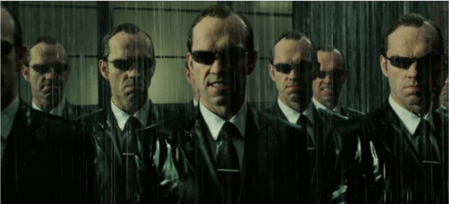
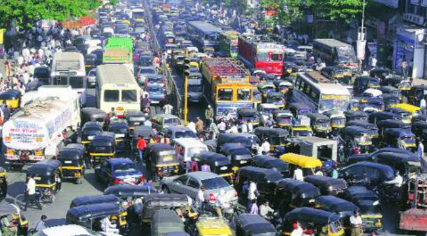

# Quiz 3

### Questão 1: Assinale a alternativa que ilustra o ambiente caracterizado na imagem a seguir

- [x] Multi-Agente ✓
- [ ] Simples Agente

### Questão 2: Assinale a alternativa que ilustra o ambiente caracterizado na imagem a seguir:

- [x] Completamente observável ✓
- [ ] Parcialmente observável

### Questão 3: Relacione as colunas com as linhas

- Braço robótico → atuadores
- Lucro com os investimentos → Medida de desempenho
- Arena de Robocode → Ambiente
- Câmera → Sensores
- Carro autônomo → agente.

### Questão 4: Sobre agentes com aprendizagem, qual das seguintes afirmativas é **incorreta**?

- [ ] Utilizam feedback e crítica de desempenho para realizar mudanças no conhecimento.
- [x] Agentes com aprendizagem supervisionada não precisam de dados rotulados. ✓
- [ ] O elemento de aprendizagem torna o agente mais eficiente ao longo do tempo.
- [ ] Podem atuar num mundo inicialmente desconhecido

### Questão 5: Com respeito ao vídeo "Meet the Robots at Amazon" , assinale a(s) sentença(s) INCORRETA(S):

- [x] Os robôs da Amazon representam uma séria ameaça aos empregos de humanos. ✓
- [x] De acordo com o chefe de robótica da Amazon, quanto mais robôs entrarem em operação, mais empregos para humanos serão criados, sendo esta uma visão compartilhada por todos os setores da sociedade. ✓
- [x] Os robôs da Amazon são reativos e não possuem adaptabilidade ao ambiente. ✓
- [ ] Para lidar com a gigantesca escala do negócio de vendas de produtos online, a empresa Amazon precisou desenvolver um sistema multi agente de robôs que podem se adaptar ao ambiente, mudando seus objetivos quando necessário.

### Questão 6: Com respeito ao texto "What’s hot in Multi-Agent Systems?" é correto afirmar que (múltiplas respostas são possíveis):

- [x] Sistemas Multi Agentes é um tipo de IA distribuída que pode ser utilizada para a coordenação de múltiplos robôs, controle de veículos autônomos, agentes inteligentes em video games, entre outros. ✓
- [ ] A área de Sistemas Multi Agentes está perdendo espaço para outras áreas, como a Robótica e a Visão Computacional.
- [x] Verificação e explicabilidade de Sistemas Multi Agentes é um tema de grande relevância: é possível verificar as ações do sistema e dar garantias sobre seu desempenho? as ações e comportamentos do sistema podem ser explicados? ✓

### Questão 7: Assinale a alternativa que ilustra o ambiente caracterizado na imagem:

- [ ] Discreto
- [x] Contínuo ✓

### Questão 8: Assinale a(s) alternativa(s) que Não ilustra(m) o ambiente caracterizado na imagem

- [x] Episódico ✓
- [x] Determinístico ✓
- [ ] Dinâmico
- [ ] Estocástico
- [x] Simples agente ✓

### Questão 9: Como você classificaria o ambiente representado nesta imagem a seguir?

- [x] Sequencial ✓
- [ ] Episódico

### Questão 10: Associe as seguintes afirmações a cada tipo de agente:

- Baseado em objetivo → Possui um estado interno e o ambiente é modelado. Também possui um planejamento futuro rudimentar baseado em métricas de interesse.
- Reativo baseado em modelo → Esse agente possui um estado interno e o ambiente é modelado, entretanto, não há planejamento futuro orientado à otimização de métricas.
- Baseado em utilidade → Possui um estado interno e o ambiente é modelado. O planejamento futur considera gradações de satisfação quanto aos seus objetivos.
- Reativo simples → Não possui um estado interno e pode ser implementado com o uso de funções e tabelas, sem necessidade de memória ou planejamento futuro.
- Com aprendizagem → Possui um estado interno e o ambiente é modelado. Sua principal característica é que é capaz de melhorar seu desempenho a partir do ganho de experiência.
