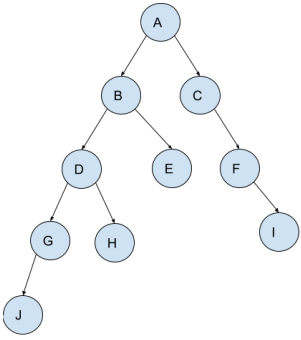
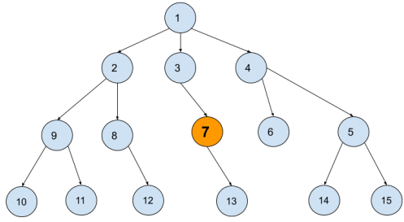

# Quiz 4

### Questão 1: O que é busca cega e quais são exemplos dela?

- [ ] A busca cega tem informações sobre os estados sucessores, ou seja, é possível decidir se determinado estado sucessor é mais ou menos promissor para atingir o objetivo do problema. Exemplos são a busca em largura e busca em profundidade.
- [ ] A busca cega não tem qualquer informação sobre os estados sucessores, ou seja, não é possível decidir se determinado estado sucessor é mais ou menos promissor para atingir o objetivo do problema. Exemplos são buscas através de heurísticas.
- [ ] A busca cega tem informações sobre os estados sucessores, ou seja, é possível decidir se determinado estado sucessor é mais ou menos promissor para atingir o objetivo do problema. Exemplos são a busca em profundidade limitada e busca em profundidade com aprofundamento iterativo.
- [x] A busca cega não tem qualquer informação sobre os estados sucessores, ou seja, não é possível decidir se determinado estado sucessor é mais ou menos promissor para atingir o objetivo do problema. Exemplos são a busca em largura e busca em profundidade. ✓
- [ ] A busca cega não tem qualquer informação sobre os estados sucessores, ou seja, não é possível decidir se determinado estado sucessor é mais ou menos promissor para atingir o objetivo do problema. Exemplos de busca são os algoritmos gulosos.

### Questão 2: Associe linhas às colunas:

- f(n) = h(n), onde h(n) é uma estimação do custo do caminho mais curto do nodo n até o objetivo → Busca heurística gulosa
- f(n) = g(n), onde g(n) dá o custo de estado inicial até o nodo n → Busca em largura
- f(n) = g(n) + h(n), onde g(n) dá o custo de estado inicial até o nodo n e h(n) é uma estimação do custo do caminho mais curto do nodo n até o objetivo → Busca heurística A\*.

### Questão 3: Um quebra-cabeça de 8 peças deslizantes pode ser formalizado da seguinte maneira:

- [ ] a. Estados: Uma descrição da posição de cada peça e do espaço vazio. Estado inicial: Qualquer estado que siga as regras do jogo. Função sucessor: estados válidos resultantes da tentativa de mover o espaço branco para baixo ou cima.Teste de objetivo: verifica se as peças estão na posição correta. Custo do caminho: o número de passos do caminho.
- [ ] Estados: Uma descrição da posição de cada peça e do espaço vazio. Estado inicial: Qualquer estado que siga as regras do jogo. Função sucessor: estados válidos resultantes da tentativa de mover o espaço branco para baixo, cima, esquerda ou direita.Teste de objetivo: verifica se o espaço em branco está na posição correta. Custo do caminho: o número de passos do caminho.
- [ ] Estados: Uma descrição da posição de cada peça e do espaço vazio. Estado inicial: Um estado que as peças estão na posição correta. Função sucessor: estados válidos resultantes da tentativa de mover o espaço branco para baixo, cima, esquerda ou direita.Teste de objetivo: verifica se as peças estão na posição correta. Custo do caminho: o número de passos do caminho.
- [x] Estados: Uma descrição da posição de cada peça e do espaço vazio. Estado inicial: Qualquer estado que siga as regras do jogo. Função sucessor: estados válidos resultantes da tentativa de mover o espaço branco para baixo, cima, esquerda ou direita.Teste de objetivo: verifica se as peças estão na posição correta. Custo do caminho: o número de passos do caminho. ✓
- [ ] Estados: Uma descrição da posição de cada peça e do espaço vazio. Estado inicial: Um estado que as peças estão na posição correta. Função sucessor: estados válidos resultantes da tentativa de mover o espaço branco para baixo ou cima.Teste de objetivo: verifica se as peças estão na posição correta. Custo do caminho: o número de passos do caminho.

### Questão 4: Associe os tipos de problemas aos agentes inteligentes abaixo:

- Problema conformante → Uma sonda espacial que perdeu acesso aos seus sensores, mas que sabe sua localização atual e tem um mapa interno de onde está seu objetivo.
- Espaço de estados desconhecido → Um robô capaz de navegar um labirinto sem conhecimento prévio, como o presente nesse vídeo: [vídeo](https://www.youtube.com/watch?v=mJV-KDqHgDQ).
- Não determinístico e/ou parcialmente observável → Um agente capaz de jogar paciência (jogo de cartas).
- Problema Determinístico → Um agente que aprendeu a ligar pontos com linhas para formar uma imagem. Ele sabe qual o ponto inicial, a localização e ordem que precisa ligar todos os outros pontos.

### Questão 5: Dada a seguinte árvore e os caminhos abaixo, marque a alternativa que contém os respectivos algoritmos de busca cega usados na ordem em que são apresentados os caminhos.

- Caminho 1: A, B, C, D, E, F, G, H, I, J
- Caminho 2: A, B, D, G, J, H, E, C, F, I
- Caminho 3: A, B, D, G, H, E, C, F, I

- [x] Busca em largura, busca em profundidade simples, busca em profundidade com limite 3 (Considerando o nó raiz como nível 0). ✓
- [ ] Busca em profundidade simples, busca em largura, busca em profundidade com limite 3 (Considerando o nó raiz como nível 0)
- [ ] Busca em profundidade com limite 4 (Considerando o nó raiz como nível 0), busca em largura, busca em profundidade
- [ ] Busca em profundidade iterativa, busca em largura, busca em profundidade simples

### Questão 6: Observe a árvore abaixo e note que o nó 7 está marcado em laranja. Ele é o nó objetivo do nosso problema.

Marque a opção que contém os custos associados (quantos nós foram visitados até encontrar o nó objetivo - incluindo o nó objetivo) aos seguintes algoritmos:

i. Busca em largura
ii. Busca em profundidade simples
iii. Busca com aprofundamento iterativo (sem qualquer otimização)
iv. Busca em profundidade com limite 2 (nó raiz está no nível 0)

Escolha uma opção:

- [x] 7, 9, 10, 6 ✓
- [ ] 7, 9, 8, 9
- [ ] 9, 7, 10, 5
- [ ] 9, 7, 8, 6
