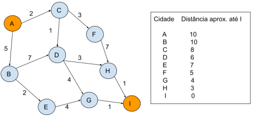
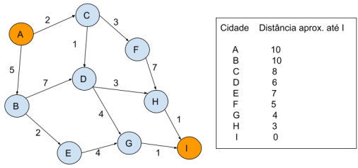
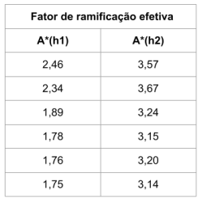

# Quiz 5

### Questão 1: Sobre heurísticas NÃO é correto afirmar:

- [ ] Heurísticas são indicadas quando o custo de busca da melhor solução não é cabível
- [ ] Se trata de uma informação acerca do domínio que pode ajudar no processo de busca ao selecionar nós mais promissores (com relação ao alcance do objetivo)
- [ ] Heurísticas são indicadas quando o problema não tem uma solução exata por ter sido formulado de forma ambígua
- [x] Seu uso é sempre indicado em problemas onde se precisa garantir que a solução será encontrada de forma ótima ✓

### Questão 2: Dado o seguinte grafo, onde os nós representam as cidades e as arestas uma distância aproximada de uma cidade à outra - em linha reta. E uma heurística que informa a distância aproximada de uma certa cidade até o nó objetivo (I). Começando de A, indique o caminho seguido pelo algoritmo “Greedy best-first search”.

Escolha uma opção:

- [x] A, C, F, H, I ✓
- [ ] A, B, D, G, I
- [ ] A, C, D, H, I
- [ ] A, B, E, G, I

### Questão 3: Dado o seguinte grafo, onde os nós representam as cidades e as arestas a distância aproximada de uma cidade à outra - em linha reta. E uma heurística que informa a distância aproximada de uma certa cidade até o nó objetivo (I). Começando de A, indique o caminho seguido pelo algoritmo “A\*”.

Escolha uma opção:

- [ ] A, C, F ,H , I
- [ ] A, B, D, G, I
- [ ] A, B, E ,G , I
- [x] A, C, D, H , I ✓

### Questão 4: Considere duas heurísticas h1 e h2 admissíveis para um determinado problema. Nós sabemos que conforme a profundidade da solução aumenta, os fatores de ramificação efetiva delas têm o seguinte comportamento:

Com isso podemos afirmar que: "A heurística 2 domina a heurística 1, pois tem os maiores fatores de
ramificação".

- [ ] Verdadeiro
- [x] Falso ✓

### Questão 5: Assinale verdadeiro ou falso:

- Uma heurística é admissível quando não superestima o custo real entre um estado inicial e o estado corrente. → verdadeiro
- É possível projetar heurísticas para um jogo a partir do relaxamento das regras do jogo. → verdadeiro
- Uma heurística admissível h1(n) domina outra heurística admissível h2(n) quando, para todo nó n no espaço de estados, h1(n) < h2(n) → falso.

### Questão 6: Calcule o fator de ramificação efetivo b\* de um algoritmo de busca que encontra a solução na profundidade d=3 e visita N=300 nós do espaço de estados antes de encontrar a solução. Forneça a resposta com 2 casas decimais.

- Resposta: **6,33**

### Questão 7: Qual das seguintes alternativas está incorreta?

- [ ] Uma heurísitca que extrapola o custo real entre o nó corrente e o nó objetivo pode levar a soluções sub-ótimas ao se adotar o algoritmo A\*.
- [ ] Se as heurísticas h1, h2, h3 são admissíveis, então pode-se definir uma meta-heurística (ou heurística composta) h de tal forma que h(n) = max(h1(n), h2(n),h3(n)) para todo nó n do espaço de estados.
- [x] No processo de escolha de melhores heurísticas para um determinado problema, quanto maior o fator de ramificação efetivo b\* computado para uma heurística melhor será a sua qualidade. ✓
- [ ] Uma heurística admissível para um jogo pode ser obtida relaxando-se as regras do jogo.

### Questão 8: Marque todas as alternativas que relacionam de forma correta jogos e heurísticas.

Escolha uma ou mais:

- [x] Muitos jogos são complexos o suficiente ao ponto de aceitarem uma grande variedade de heurísticas. ✓
- [x] Jogos podem ter espaços de buscas de tamanho suficiente para requererem podas heurísticas e geralmente suas representações são mais simples do que as de problemas reais. ✓
- [ ] O entendimento de heurísticas que se é ganho com jogos não pode ser generalizado, servindo apenas de treino para praticantes da área de IA.
- [ ] Jogos são pouco úteis no que diz respeito ao estudo de heurísticas, pois são problemas bastante simples em comparação com os reais.
