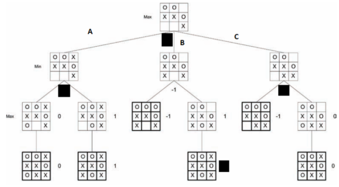
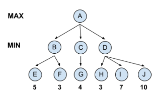
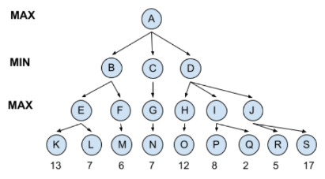

# Quiz 6

### Questão 1: Sobre o algoritmo minimax é CORRETO afirmar que:

Escolha uma ou mais:

- [ ] O algoritmo é limitado a jogos determinísticos e simples, não podendo ser utilizado em jogos onde há presença de incerteza.
- [x] A partir do fim dos estados terminais o algoritmo encontra a melhor jogada caminhando pelas opções válidas na direção do início do jogo. ✓
- [ ] O algoritmo pode não encontrar soluções ótimas, apesar de ter conseguido avaliar toda a árvore de estados e não haver incertezas no jogo.
- [x] O algoritmo tenta maximizar a chance de vitória do agente, considerando que o oponente será ótimo (fará a melhor jogada após a jogada do agente). ✓

### Questão 2: Considere a seguinte figura, que ilustra uma sub-árvore de execução do algoritmo minimax no jogo-da-velha. Utilizando a ordem de leitura (de cima para baixo e da esquerda para a direita), quais valores devem estar presentes nas caixas pretas e qual deverá ser o movimento escolhido pelo algoritmo?

- Movimento: A ✓
- Valores: 0, 0, -1, 1 ✓

### Questão 3: É INCORRETO afirmar o seguinte sobre poda α-β:

Escolha uma opção:

- [ ] Determina o próximo movimento sem precisar examinar todos os nós da árvore.
- [x] Dois valores limites precisam ser mantidos: um representando o limite inferior que um nó minimizante poderá receber em última instância (alfa), e outro representando o limite superior de valor que um nó maximizante poderá ter (beta) ✓
- [ ] Retorna o mesmo que minimax, porém sem muitas vezes ter que percorrer todos os estados.
- [ ] Representa um melhoramento do algoritmo minimax.

### Questão 4: Considerando a seguinte árvore de execução do algoritmo minimax (com somente os valores dos nós terminais), onde os maiores valores são os estados avaliados mais positivamente. Marque abaixo quais estados seriam ignorados (não avaliados) pela estratégia de poda α-β e o movimento que será escolhido pelo algoritmo.

Escolha uma opção:

- [x] I e J seriam ignorados. O movimento será de A para C. ✓
- [ ] F, I e J seriam ignorados. O movimento será de A para C.
- [ ] I e J seriam ignorados. O movimento será de A para B.
- [ ] F e G seriam ignorados. O movimento será de A para B.

### Questão 5: Considerando a seguinte árvore de execução do algoritmo minimax (com somente os valores dos nós terminais), onde os maiores valores são os estados avaliados mais positivamente. Marque abaixo qual o caminho que será escolhido pelo algoritmo se os dois jogadores realizarem as melhores jogadas.

Escolha uma opção:

- [ ] A, B, F, M
- [x] A, D, I, P ✓
- [ ] A, B, E, L
- [ ] A, D, J, S
