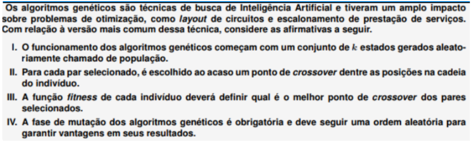

# Quiz 7

### Questão 1: Relacione os conceitos de evolução natural com os de algoritmos genéticos

- Mutação → Operador de Busca
- Crossover → Operador de Busca
- População → Conjunto de soluçoes
- Cromossomo → Representação de uma solução
- Adaptação/aptidão ao ambiente → Função Fitness
- Gene → Parte da representação da solução
- Indivíduo → Solução de um problema computacional
- Seleção Natural → Reutilização de boas aproximações

### Questão 2: Acerca dos algoritmos genéticos é INCORRETO afirmar que:

Escolha uma opção:

- [ ] Em um algoritmo genético, os indivíduos que foram selecionados para cruzar geram novos indivíduos a partir da recombinação de suas representações (dependente do problema), os quais podem sofrer o efeito de mutações com uma certa probabilidade (geralmente baixa).
- [ ] Vários critérios de parada podem ser aplicados aos algoritmos genéticos, entre eles estão: convergência da função de fitness, não aumento da aptidão em um certo número de gerações ou simplesmente o número de gerações.
- [ ] Funções de avaliação (fitness) são usadas pelos algoritmos genéticos com vistas a estimar a qualidade de uma determinada solução (indivíduo). Geralmente, são medidas quantitativas que ligam o programa ao domínio do problema.
- [x] Via de regra, os estados sucessores são gerados a partir de modificações em um único estado inicial, baseado nas suas melhores qualidades. Este processo gera diversas soluções possíveis e permite uma busca mais eficiente no espaço de estados do problema. ✓

### Questão 3: Leia as alternativas e assinale a opção correta

Escolha uma opção:

- [x] Somente as afirmativas I e II são corretas ✓
- [ ] Somente as afirmativas I, II e IV são corretas
- [ ] Somente as afirmativas III e IV são corretas
- [ ] Somente as afirmativas I e IV são corretas

### Questão 4: Acerca do processo de seleção de soluções para cruzamento, indique a(s) respostas corretas:

Escolha uma opção:

- [x] Estratégias para a escolha de soluções que irão cruzar dependem em parte da aleatoriedade, todavia favorecem os indivíduos mais aptos, como no caso da roleta e torneio. ✓
- [x] Uma boa estratégia de seleção de indivíduos faz com que, depois de um certo número de gerações aceitável, a partir da população inicial, sejam produzidos indivíduos mais aptos.
- [x] Na estratégia de torneio, x indivíduos são escolhidos aleatoriamente e a solução de maior aptidão é escolhida. Esse processo se repete, o que resulta nas y soluções que irão sofrer cruzamento.
- [ ] Normalmente, a escolha de soluções que serão cruzadas é aleatória e não depende do valor da função de fitness em nenhum grau, dado que isso maximiza as chances de encontrar os melhores pares.
